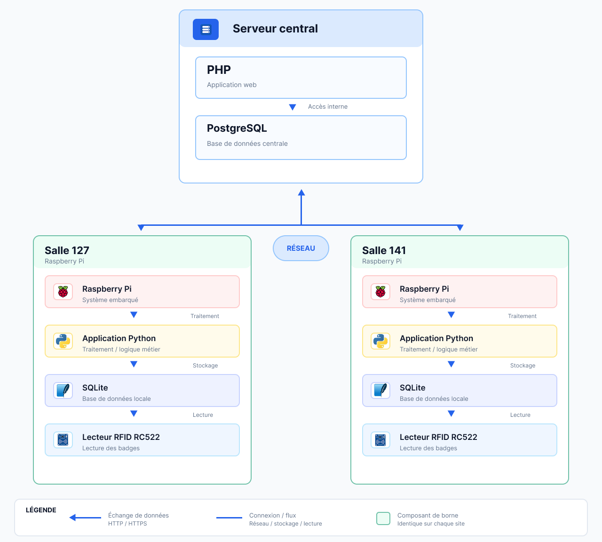
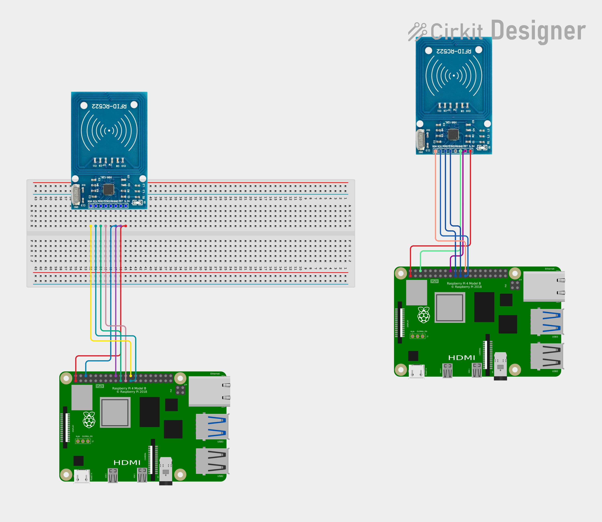

<!-- TO DO 
- changer le nom des img
- changer les images pour les rendre + pro
- Améliorer le rendu
- Vérif sur git -->
-- --

<table>
  <tr>
    <td align="left">
      
    </td>
    <td align="center">
      <h1>Document d'architecture</h1>
    </td>
    <td></td>
  </tr>
</table>

-- --

### Différents composants et leur rôle

| Composant | Rôle |
|:---|:---|
| **Raspberry Pi** | Ordinateur qui exécute le programme Python et gère le lecteur RFID ainsi que le stockage des données. |
| **Lecteur RFID RC522** | Permet de lire l'identifiant du badge RFID présenté par l'étudiant. |
| **7 câbles** | Permettent de relier le lecteur RFID RC522 au Raspberry Pi. |

### Organisation du logiciel exécuté sur le Raspberry Pi

| Élément | Fonction |
|:---|:---|
| **Base de données SQLite** | Stockage local des données sur le Raspberry Pi. |
| **Programme Python** | Lecture du badge RFID, enregistrement des données et synchronisation avec le serveur central. |
| **Communication avec le serveur central** | Envoi des données de SQLite vers PostgreSQL. |

### Organisation de la base de données

| Base de données | Fonction |
|:---|:---|
| **SQLite** | Stockage local des données sur chaque Raspberry Pi. |
| **PostgreSQL** | Récupère les données des différentes BDD SQLite. |

### Communications entre les différents composants
- Connexion entre le Raspberry Pi et le lecteur RFID RC522 :

| RC522 | Raspberry Pi 4B | Rôle |
|:------|:----------------|:-----|
| 3.3V | Pin 1 (3.3V) | Alimentation |
| RST | Pin 22 (GPIO25) | Réinitialisation |
| GND | Pin 6 (GND) | Masse |
| MISO | Pin 21 (GPIO9) | Données du RC522 vers le Raspberry Pi |
| MOSI | Pin 19 (GPIO10) | Données du Raspberry Pi vers le RC522 |
| SCK | Pin 23 (GPIO11) | Horloge SPI |
| SDA | Pin 24 (GPIO8 / CE0) | Sélection du lecteur |

- Synchronisation entre SQLite et PostgreSQL via Python.
- Utilisation de PHP pour faire le lien entre l'interface web et la BDD PostgreSQL.

### Stratégie de synchronisation

| Élément | Description |
|:---|:---|
| **Stockage local SQLite** | puis synchronisation des données vers la base de données centralisée PostgreSQL. |
| **Données non synchronisées** | Les données non synchronisées sont conservées dans SQLite jusqu'à ce qu'elles puissent être envoyées au serveur. |

### Gestion des pertes de connexion lors des phases de pointage

| Situation | Fonctionnement |
|:---|:---|
| **Perte de connexion** | En cas de perte de connexion avec le serveur central, le pointage continue normalement grâce au stockage local dans SQLite. |
| **Connexion rétablie** | Une fois la connexion rétablie, les données enregistrées localement sont synchronisées avec PostgreSQL. |

### Gestion des erreurs

| Élément | Description |
|:---|:---|
| **Gestion des erreurs** | Liste à incrémenter dans le temps |

### Choix technologiques

| Technologie | Utilisation et justification |
|:---|:---|
| **Python** | Utilisation de **Python** sur le Raspberry Pi : Python est adapté au projet car il permet de gérer facilement le lecteur RFID, les bases de données et la synchronisation avec le serveur central. Il dispose également de nombreuses bibliothèques compatibles avec le Raspberry Pi. |
| **SQLite** | Utilisation de **SQLite** pour le stockage local : SQLite est adapté au Raspberry Pi car il fonctionne sans serveur de base de données et stocke les données directement dans un fichier. Il est donc léger et suffisant pour enregistrer les pointages localement, notamment lorsque la connexion au serveur central est indisponible. |
| **PostgreSQL** | Utilisation de **PostgreSQL** pour la base de données centralisée : PostgreSQL est adapté à une base centralisée car il permet de gérer plusieurs Raspberry Pi et un volume important de données. Il offre également une bonne gestion des relations entre les différentes tables. |
| **PHP** | Utilisation de **PHP** pour l'interface web : PHP permet de créer une interface web capable de communiquer directement avec PostgreSQL. C'est également un langage robuste et fiable, adapté au développement d'applications web. |

-- --
# Annexes

## Schéma Architecture utilises

## Schema de câblage Raspberry <-> lecteur RFID

